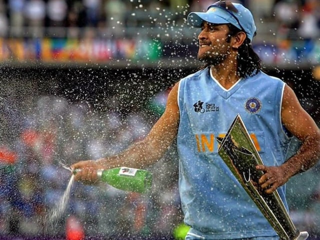

# 🏏 MS Dhoni Tribute Page



An interactive tribute page celebrating the legendary Indian cricketer MS Dhoni, featuring animated content and career statistics.

## 🌟 Features
- 🎬 GSAP animations for smooth scrolling effects  
- 📊 Complete career statistics in tabular form  
- 📸 Image gallery with hover effects  
- ✨ Gradient text styling  
- 📱 Responsive design  

## 🛠 Tech Stack
| Frontend | Animations | Icons |
|----------|------------|-------|
|  HTML5 |  GSAP |  Image Gallery |
|  CSS3 |  ScrollTrigger |  Stats Table |
|  JavaScript | | |

## 🏏 Content Sections
```bash
1. Hero Header (Animated) 
2. About Dhoni 
3. Career Statistics Table 
4. Personal Life 
5. Famous Quotes 
6. Achievements (Animated)

🎥 Animation Highlights
// Sample GSAP animations from app.js
gsap.from(".head1", {
  x: -750,
  duration: 4,
  delay: 2
});

gsap.from(".h4i", {
  x: -700,
  scrollTrigger: {
    trigger: "body",
    start: "bottom 90%"
  }
});

📊 Career Stats Preview
Competition	    Test	ODI	    T20Is
Matches	        90	    350	    98
Runs	        4876	10773	1617
Highest Score	224	    183*	56

🏆 Key Achievements
🏆 2007 ICC T20 World Cup Winner
🏆 2011 ICC ODI World Cup Winner
🏆 2013 ICC Champions Trophy Winner
🏆 5× IPL Titles with CSK

🖼️ Media Used
📂 images/
├── pic1.jpg - Hero image
├── pic2.jpg - About section
├── pic3.jpg - Personal life
├── pic4.jpg - Achievements
└── pic5.webp - Quotes section

🚀 How to Run
Clone repository
Open index.html in browser
Scroll to trigger animations

🌈 Design Elements
Gradient text effects
Image hover animations
Custom scroll-triggered content reveals
Responsive table layout

📜 License
MIT Licensed - Free to use and modify
 "Dhoni finishes off in style!"
 Star this repo if you're a Dhoni fan!


**Key Features:**
1. **Cricket-Themed Icons**: Uses relevant cricket and web development icons
2. **Code Preview**: Shows sample GSAP animations
3. **Stats Table**: Highlights key career statistics
4. **Media Structure**: Documents image usage
5. **Responsive Ready**: Mentions responsive design
6. **Dhoni-Specific Content**: Focuses on his achievements and legacy

The icons will render automatically on GitHub/GitLab. For best viewing:
1. Ensure all image paths are correct
2. The GSAP animations will work when the page is viewed in a browser
3. The table formatting appears best on GitHub's markdown renderer
